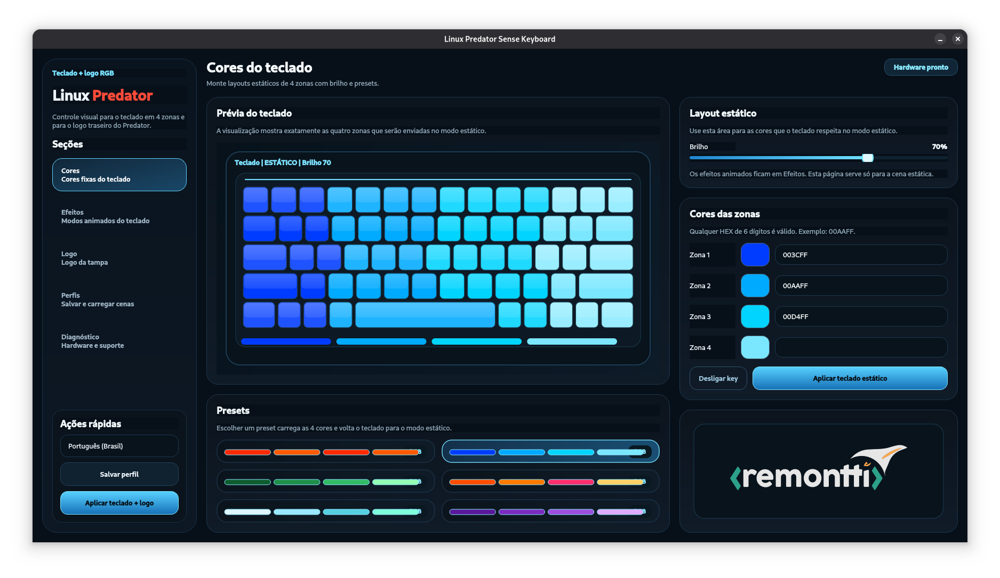
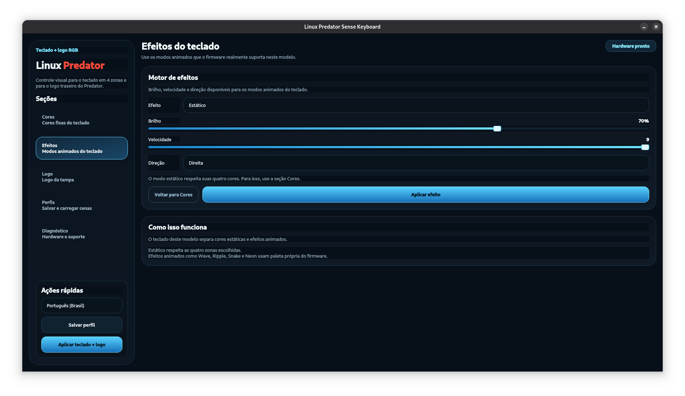
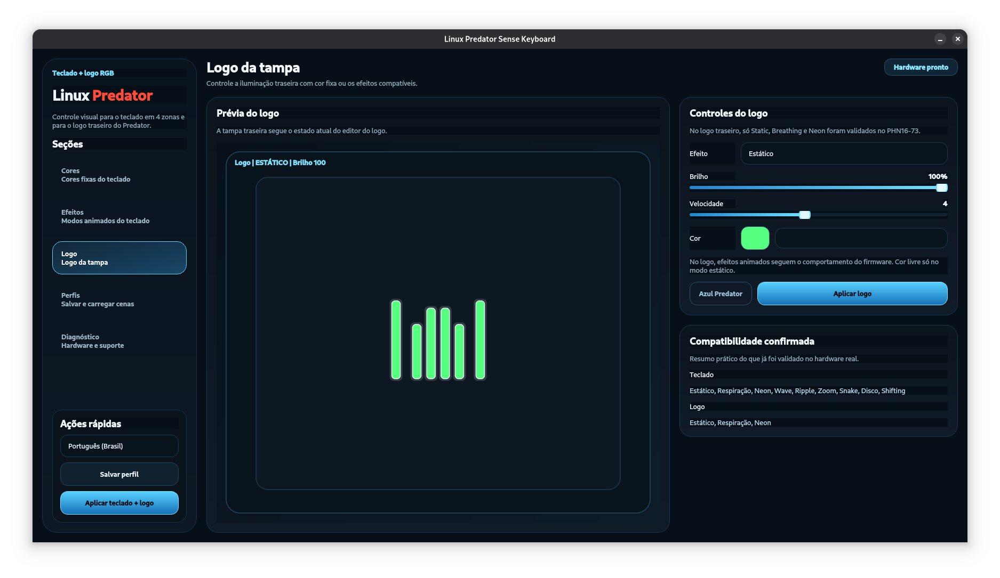
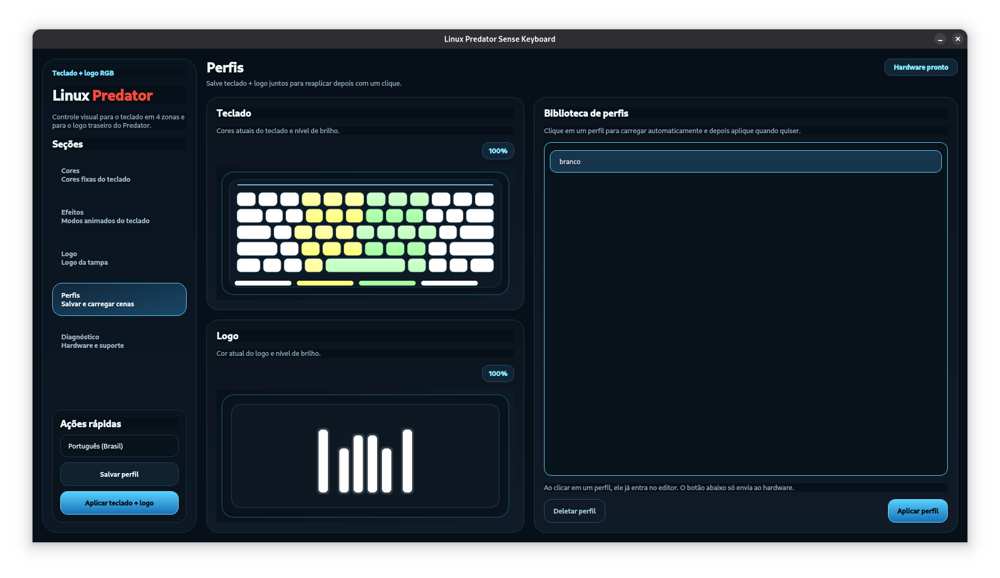

# Linux Predator Sense Keyboard

Desktop app and CLI to control the RGB keyboard and rear lid logo of Acer Predator laptops on Linux.

This project was built around the **Acer Predator PHN16-73** and validated on **Debian 13 (Trixie)** with **GNOME 48**. The first public target is the **Predator Helios Neo 16 AI** family, but the code is open for the community to extend.

> Warning
>
> This is an independent community project. It is **not** an official Acer product, it is **not** affiliated with Acer, and the authors do **not** accept responsibility for failures, data loss, hardware issues, or any other damage resulting from its use. Use it at your own risk.

## What It Does

- controls the **4-zone keyboard**
- controls the **rear lid logo**
- supports **static colors**
- supports the keyboard effects already validated on this hardware
- supports the lid effects already validated on this hardware
- saves and reapplies **profiles**
- includes a GUI with **Portuguese (Brazil)**, **English**, and **Spanish**
- installs as a normal Linux app under `/opt/Linux Predator Sense Keyboard`

## Validated Hardware

Tested model:

- Acer Predator PHN16-73
- Family: Predator Helios Neo 16 AI
- Debian 13 Trixie
- Kernel: `6.12.74+deb13+1-amd64`
- Desktop: GNOME 48.4

Validated behavior on this machine:

- keyboard static color works
- keyboard 4-zone color works
- keyboard animated effects work
- lid static color works
- lid `breathing` works
- lid `neon` works

Important behavior note:

- in **Static** mode, the keyboard respects the 4 chosen zone colors
- in **animated keyboard effects**, the controller uses its own firmware palette and ignores the selected zone colors

## Supported Effects

Keyboard:

- `static`
- `breathing`
- `neon`
- `wave`
- `ripple`
- `zoom`
- `snake`
- `disco`
- `shifting`

Lid logo:

- `static`
- `breathing`
- `neon`

## Screenshots

<p align="center">
  
  
</p>

<p align="center">
  
  
</p>

## Demo Video

- [Watch the app demo video](prints/video.mp4)

## How It Works

This project talks to the RGB controller through the HID path used by the **ENEK5130** controller found on the `PHN16-73`.

During install, the project:

1. installs the Python/Qt dependencies from the Debian repository
2. copies the app to `/opt/Linux Predator Sense Keyboard`
3. installs a desktop launcher for GNOME
4. installs an icon
5. installs a `udev` rule that creates `/dev/acer-rgb` with direct access for local use

Profiles and settings are stored in:

```text
~/.config/linux-predator-sense-keyboard/
```

## Install

1. enter the project directory

```bash
cd "<repo-dir>"
```

2. make the scripts executable

```bash
chmod +x install.sh uninstall.sh
```

3. run the installer

```bash
sudo ./install.sh
```

4. if the app still asks for `sudo`, log out and log back in once so the new `udev` permissions are applied to your session

## Launch

After install, open it from the GNOME app grid:

- `Linux Predator Sense Keyboard`

After the `udev` rule is active, the normal path is to run the app without any password prompt.
`pkexec` is kept only as a fallback if direct HID access is still blocked on a specific setup.

Or launch it from the terminal:

```bash
linux-predator-sense-keyboard
```

## Uninstall

Standard uninstall:

```bash
sudo ./uninstall.sh
```

Remove installed files and also erase user profiles/settings:

```bash
sudo ./uninstall.sh --purge-config
```

## CLI Usage

The installer also creates a CLI launcher:

```bash
linux-predator-sense-keyboard-rgb
```

Examples:

Set one color on the whole keyboard:

```bash
linux-predator-sense-keyboard-rgb set-all 00aaff 70
```

Set 4 different zones:

```bash
linux-predator-sense-keyboard-rgb set-zones ff0000 00ff00 0000ff ffffff 100
```

Apply a keyboard effect:

```bash
linux-predator-sense-keyboard-rgb effect wave --brightness 70 --speed 5 --direction right
```

Apply a lid logo effect:

```bash
linux-predator-sense-keyboard-rgb effect breathing --device lid --brightness 70 --speed 4
```

## GUI Sections

- `Colors`: static keyboard colors and presets
- `Effects`: animated keyboard modes
- `Logo`: rear lid logo color/effects
- `Profiles`: save and load scenes
- `Diagnostics`: technical information and compatibility details

## Project Layout

```text
app/linux_predator_sense/   Python package, GUI and HID backend
assets/                     icon assets
packaging/                  desktop file and udev rule
scripts/                    GUI launcher and CLI launcher
install.sh                  Debian/Opt installer
uninstall.sh                uninstaller
README.md                   project guide
```

## Inspirations And References

These projects helped guide discovery, protocol understanding, UI direction, or packaging ideas:

- `Linuwu-Sense`
  - https://github.com/0x7375646F/Linuwu-Sense
- `Div-Acer-Manager-Max`
  - https://github.com/PXDiv/Div-Acer-Manager-Max
- `Linuwu-Sense-GUI`
  - https://github.com/kumarvivek1752/Linuwu-Sense-GUI
- `acer-lighting-daemon`
  - https://github.com/fcrespo82/acer-lighting-daemon

The official Windows package `PredatorSense_5.1.468` was also inspected as part of the reverse-engineering process.

## Attribution And Review Status

This repository was produced primarily with **GPT-5.4**, under iterative instructions, decisions, and real hardware testing by **Rudimar Remontti**.

Important note:

- this code has **not** gone through independent external human review yet
- it should be treated as a community project and validated carefully on other Acer models before wider use

## Current Scope

This project is intentionally focused on:

- keyboard RGB
- lid logo RGB
- usability on Linux

It does **not** currently try to cover:

- fan control
- system monitoring
- battery charging limits
- a full PredatorSense clone
